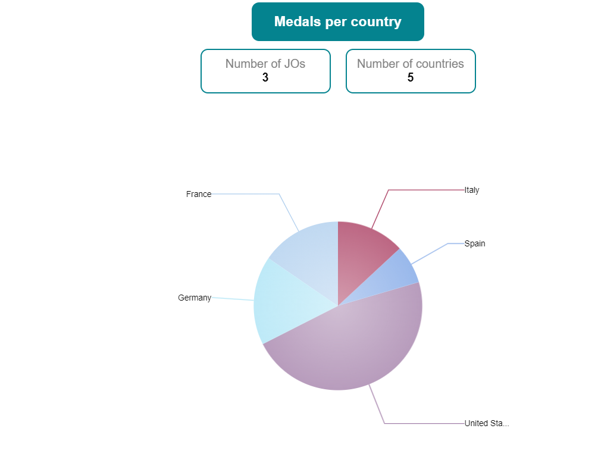
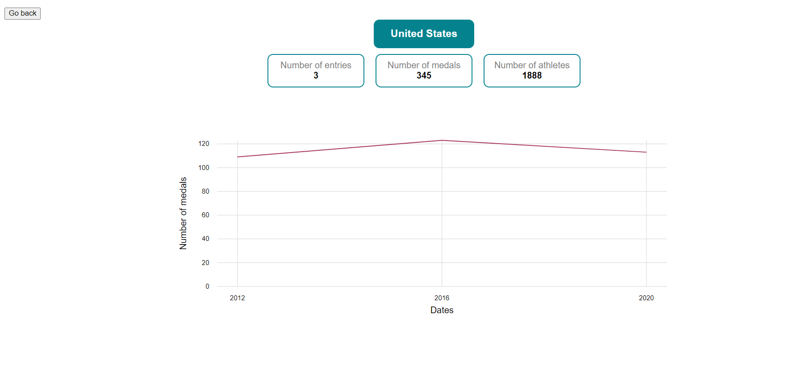
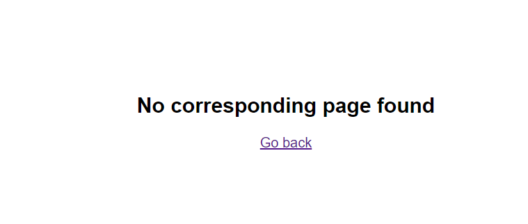

[](https://angular.io/)
[](https://www.npmjs.com/)
[](https://swimlane.gitbook.io/ngx-charts)
[](https://github.com/AntoineCanda/Developpez-le-front-end-en-utilisant-Angular/releases)

# OlympicGamesStarter

This project was generated with [Angular CLI](https://github.com/angular/angular-cli) version 17.3.3.

Don't forget to install your node_modules before starting (`npm install`).

## Development server

Run `ng serve` for a dev server. Navigate to `http://localhost:4200/`. The application will automatically reload if you change any of the source files.

## Build

Run `ng build` to build the project. The build artifacts will be stored in the `dist/` directory.

## Project Architecture

In addition to the default Angular architecture, the predefined structure includes the following:

- `pages` folder: contains components used for routing
- `core` folder: contains the business logic (`services` and `models` folders)

## Project Pages

There are three different pages within the project:

## Project Pages

There are three different pages within the project:

- **Home Page** (`http://localhost:4200/`): Displays a pie chart representing the total number of medals each country has won during all Olympic Games.



- **Details Page** (`http://localhost:4200/details/:countryName`): Displays a line chart representing the number of medals per year for the specified country, :countryName.



- **Not Found Page** (Others):
  Displays a message indicating that the requested page could not be found. You can return to the previous page by clicking [here](http://localhost:4200/).


## Responsive Design

To ensure responsiveness, I opted to use flexbox on the website's pages. You can easily test this using the developer tools console (press F12 when on the site).

In the top toolbar on the left, there is an icon representing both a desktop and a mobile device. Clicking on it allows you to emulate a responsive view with different screen sizes (mobile or iPad).

## Best Practices

I followed best practices throughout the project:

- Using a more recent version of Angular to avoid technical debt from the outset.
- Employing meaningful variable and function names for self-documented code.
- Adding comments to functions when necessary.
- Creating interfaces for strongly typed variables.
- Utilizing observables and preventing memory leaks.
- Ensuring only one call is made to retrieve input data.
- Providing indicators when waiting for data or when no data is available for the current entry.

### Example of Providing Loading Indicators

To provide loading indicators, I used the following code:

```html
<ng-template #loading>
  <p>We are getting the data. Please wait...</p>
</ng-template>
